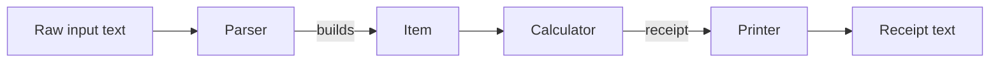
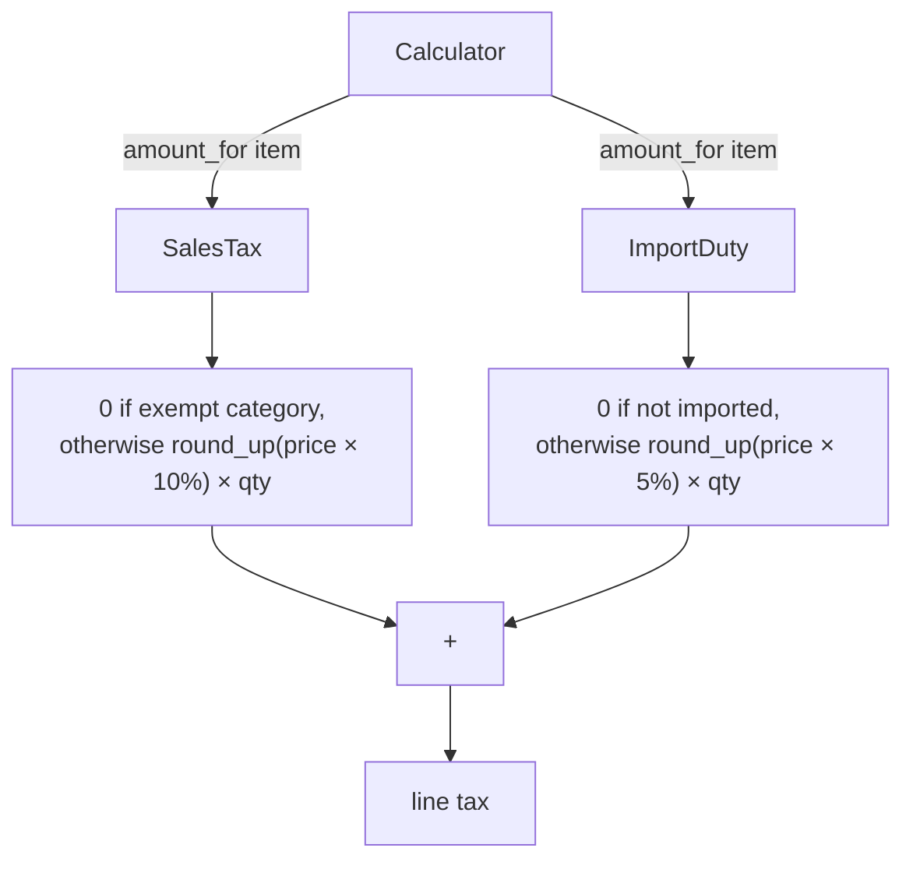
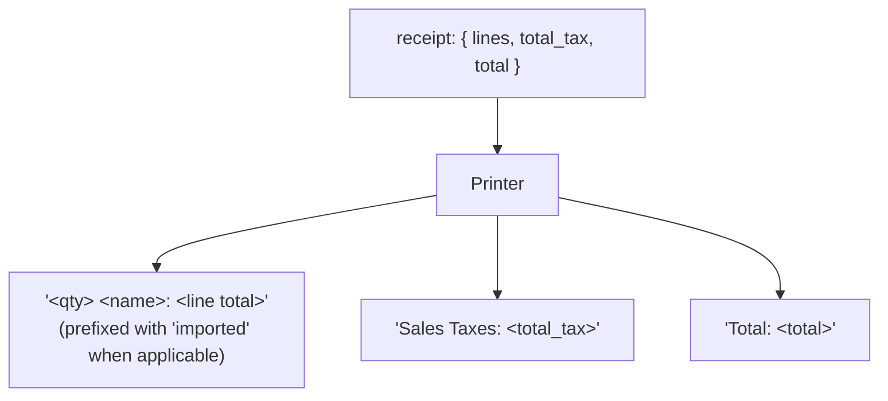

# Sales Tax

Pure Ruby (no Rails or other frameworks). The only dependency is RSpec, used exclusively for testing.

## Requirements

- Ruby 3.3+ (tested with 3.3.10)
- Bundler

## Installation

```
bundle install
```

## Running the tests

```
bundle exec rspec
```

## Running the application

```
./bin/run <input_name>
```

`<input_name>` is the file name (without extension) of a basket in the `inputs/` directory, e.g.:

```
./bin/run input_1
```

## Assumptions

- The input has no explicit product category (book, food, medical), so it's inferred from keywords in each item's name (e.g. "book", "chocolate", "pill"). This is a simplification made because the challenge's input format doesn't provide this information explicitly — see `DECISIONS.md` for further reasoning and known limitations.

## Walkthrough

This is how the solution took shape, step by step.

### 1. Understanding the problem before writing any code

Before touching any code, I read the challenge statement carefully and made sure I understood the two tax rules (sales tax with exemptions, import duty with no exemptions) and the rounding rule (round up to the nearest 0.05, per shelf price) exactly as described. I wanted the shape of the solution before getting attached to any implementation detail.

### 2. Setting up a pipeline skeleton

I split the problem into three responsibilities from the start, wired by an `Application` orchestrator:



At this stage, `Parser#parse`, `Calculator#receipt` and `Printer#print` all just raised `NotImplementedError` — the goal was to validate the wiring itself (via a spec with mocks) before any real logic existed. `Calculator` never touches raw input or the rendered output directly, which keeps the tax domain isolated from how input arrives or how the receipt looks.

### 3. Feeding it real input

I kept the challenge's three sample baskets as plain text files (`inputs/input_1.txt`, `input_2.txt`, `input_3.txt`), in their original format, instead of converting them to something like CSV. Parsing the original free-text format is closer to the actual problem and shows real parsing logic, rather than sidestepping it.

### 4. Item as a real model, and a flat 10% end-to-end run

`Item` became a proper class (not a Struct), with named-argument initialization and validation of its own data integrity: name present, quantity greater than zero, unit price not negative. Those checks are about the Item's own data — separate from tax/exemption rules, which belong to tax logic, not the Item.

At this point I ran a flat 10% tax on every item, with no exemptions yet, just to prove the full pipeline worked end-to-end against `input_1.txt` before layering in the real business rules.

### 5. Sales tax exemption by category

The input has no explicit category, so I infer it from keywords in the item's name via a small `Categorizer` class. `SalesTax` became its own class, owning both the exemption rule and the calculation:

```mermaid
flowchart TD
    Name[item name] --> Categorizer
    Categorizer -->|"book"| Book(":book")
    Categorizer -->|"chocolate"| Food(":food")
    Categorizer -->|"pill" / "pills"| Medical(":medical")
    Categorizer -->|no keyword match| Other(":other")

    Book --> Item
    Food --> Item
    Medical --> Item
    Other --> Item

    Item["Item\n(name, quantity, unit_price, imported, category)"]

    Item --> SalesTax
    SalesTax -->|category exempt?| Exempt{book / food / medical?}
    Exempt -->|yes| Zero["0"]
    Exempt -->|no| Amount["round_up(unit_price × 10%) × quantity"]
```

`Calculator` stopped computing tax itself — it delegates to a list of tax objects (`taxes:`, defaulting to `[SalesTax.new]`), which is the extension point for adding more taxes without ever touching `Calculator`.

### 6. Import duty

`ImportDuty` followed the same shape as `SalesTax`: a flat 5%, applied only when `item.imported` is true, with no category exemptions. The nearest-nickel rounding logic is shared between both taxes through a `NickelRounding` module, so it isn't duplicated.



Adding `ImportDuty` required no change to `Calculator` at all — only adding it to the default `taxes` list. Each tax rounds its own amount independently before the two get summed, which is what makes the numbers match the challenge's expected output exactly (verified against all three sample baskets).

### 7. Rendering the receipt

`Printer` receives the plain `receipt` hash `Calculator` produces (line items, total tax, total) and renders it as text, in the exact format the challenge describes:



The "imported" prefix is added by `Printer`, not stored on `Item#name` — keeping that word out of the domain data means `Categorizer`'s keyword matching and the tax classes never have to account for it; it's purely a presentation concern.

## How I Used AI

I used Claude Code (in chat mode) as a pair-programming collaborator throughout this challenge — not as a "vibe coding" tool that writes the whole solution unsupervised. For every step, I directed what to build and how: I made the architectural calls (pipeline split, where exemption logic lives, when to introduce a model or a new tax class), discussed trade-offs with it before implementing anything, and reviewed what it produced. In a few cases I asked for its opinion on a design choice (e.g. Struct vs. a proper class for `Item`) and decided whether to accept, adjust, or reject the suggestion. `DECISIONS.md` in this repo captures that decision trail as it happened.
